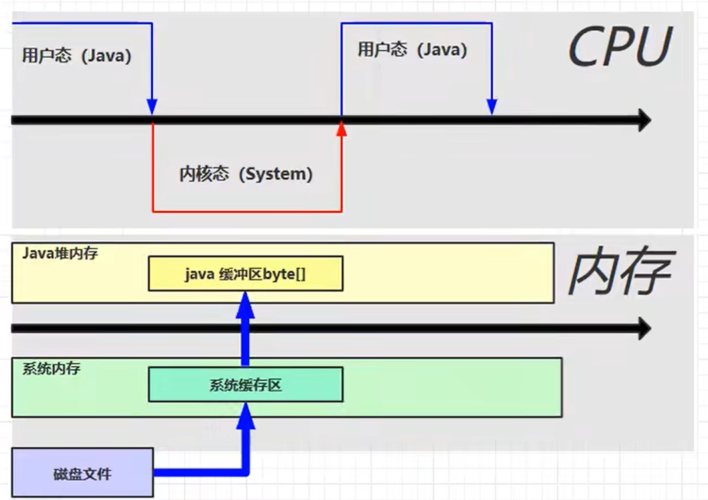
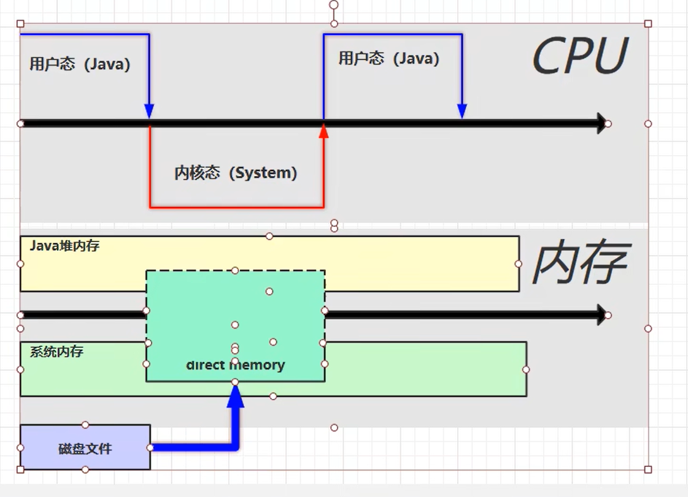

## 6.1 直接内存定义
- 属于操作系统的内存

**Direct Memory**
-[ ] 常见于NIO操作时，用于数据缓冲区
-[ ] 分配回收成本较高，但读写性能高 
- [ ] 不受JVM 内存回收管理 

> 传统的IO方法

> 使用ByteBuffer，直接内存读写效率非常的高-  文件读取过程如下

## 6.3 分配和回收原理
1. 使用了Unsafe对象完成直接内存的分配回收，并且回收需要主动调用freeMemory方法
2. ByteBuffer 的内部实现，使用了Cleaner（虚引用）来检测ByteBuffer对象，一旦ByteBuffer对象被垃圾回收，那么就会有ReferenceHandle线程通过Cleaner 的clean方法调用freeMemory来释放直接内存