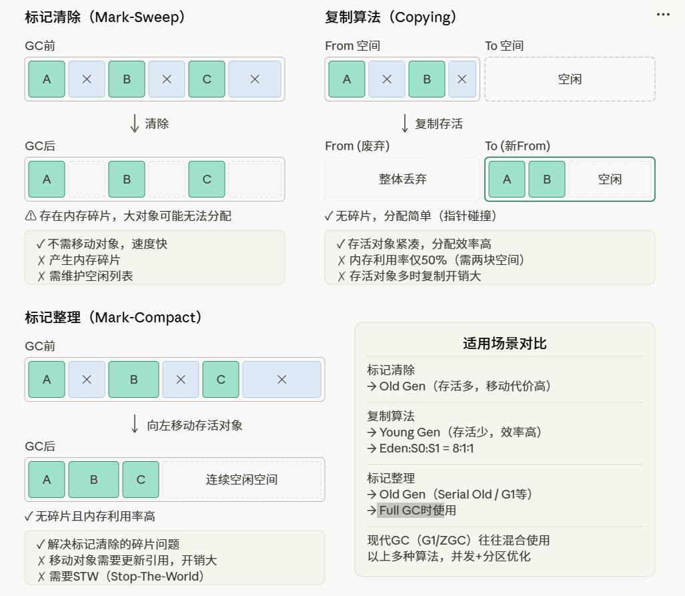

## 2.1 标记清除算法
- 两个阶段 ，先标记，再清除
- 优点： 速度快
- 缺点：容易产生内存碎片，空间不连续

## 2.2 标记整理算法
- 两个阶段： 1.先标记 存活较多的对象，2.整理
- 优点：没有内存碎片
- 缺点：速度较慢，需要移动存活的对象，移动在一起

## 2.3 复制算法
1. 总是将内存空间划分两个区域 From 和 To 区
2. TO区保持空闲，当From区域产生不连续的空间时，将From中的对象移到To，然后清除From区垃圾对象，From变为空内存
3. 交换 From 和To ,使得 To又是空内存

- 优点：不会产生内存碎片
- 缺点：总有一个空闲的内存没有使用，浪费内存

### 三种算法核心内容
- **标记清除（Mark-Sweep）** 分两阶段：先从 GC Roots 出发标记所有可达对象，再扫描堆把未标记的对象回收。优点是不需要移动对象，缺点是会产生大量不连续的内存碎片，可能导致大对象分配失败触发 Full GC。

- **复制算法（Copying）** 把内存分成两块，每次只用一块，GC 时把存活对象复制到另一块，然后整体清空原来那块。没有碎片，分配用"指针碰撞"极快，但内存利用率只有 50%。JVM Young Gen 用的就是这个思路（Eden + 两个 Survivor），存活率低时效率极高。

- **标记整理（Mark-Compact）** 在标记清除基础上多了一步"整理"：把存活对象往一端滑动紧凑，然后清掉边界以外的内存。解决了碎片问题，内存利用率也高，代价是需要移动对象、更新所有引用，整理期间必须 STW，开销比前两者都大。

---

## 高频面试题

**Q1：三种 GC 算法各有什么优缺点？分别适用于什么场景？**

| 算法 | 优点 | 缺点 | 适用场景 |
|------|------|------|----------|
| 标记清除 | 不移动对象，速度快 | 产生内存碎片 | 老年代（CMS 第一步） |
| 复制算法 | 无碎片，分配效率高 | 内存利用率只有 50% | 新生代（存活率低） |
| 标记整理 | 无碎片，内存利用率高 | 需移动对象，STW 时间长 | 老年代（Serial Old、G1） |

---

**Q2：为什么新生代用复制算法，老年代用标记整理？**

- **新生代**：对象存活率极低（98% 以上会被回收），每次 GC 只需复制少量存活对象，复制成本低；JVM 将新生代划分为 Eden（80%）+ Survivor×2（各 10%），实际内存浪费只有 10%，不是 50%。
- **老年代**：对象存活率高，如果用复制算法需要复制大量对象，成本极高；用标记整理虽然慢，但内存利用率高，且老年代 GC 频率低，可以接受较长的 STW。

---

**Q3：什么是 STW（Stop The World）？为什么 GC 需要 STW？**

- STW 指 GC 发生时，JVM 暂停所有用户线程，只让 GC 线程工作。
- 原因：GC 过程中需要扫描对象引用关系，如果用户线程同时修改对象引用，会导致标记结果不准确（漏标/错标），引发对象被误回收或内存泄漏。
- 优化方向：减少 STW 时间，如 CMS 的并发标记、G1 的增量回收。

---

**Q4：CMS 垃圾收集器用的是哪种算法？有什么问题？**

CMS（Concurrent Mark Sweep）使用**标记清除**算法：
- **并发标记**：GC 线程与用户线程并发执行，减少 STW 时间。
- **问题**：
  1. **内存碎片**：标记清除会产生碎片，长时间运行后可能触发 Full GC（此时退化为 Serial Old 用标记整理）。
  2. **浮动垃圾**：并发标记阶段用户线程仍在运行，可能产生新的垃圾，本次 GC 无法回收，只能等下次。
  3. **CPU 资源竞争**：并发阶段 GC 线程与用户线程争抢 CPU。

---

**Q5：G1 收集器是如何解决碎片问题的？**

- G1 将堆划分为大小相等的 **Region**（默认 1~32MB），每个 Region 可以动态扮演 Eden、Survivor、Old 角色。
- 回收时优先选择**垃圾最多的 Region**（Garbage First），对选中的 Region 使用**复制算法**将存活对象移到其他 Region，然后整体释放该 Region。
- 因为是复制而非清除，**不会产生碎片**，同时通过控制每次回收的 Region 数量来控制 STW 时间（可预测停顿）。

---

**Q6：Minor GC、Major GC、Full GC 的区别？**

| 类型 | 回收区域 | 触发条件 | STW |
|------|----------|----------|-----|
| Young GC | 新生代 | Eden 区满 | 短暂 |
| Old GC | 老年代 | 老年代空间不足 | 较长 |
| Full GC | 整个堆 + 方法区 | 老年代满、System.gc()、空间担保失败 | 最长 |

> 面试重点：Full GC 是性能杀手，调优目标就是减少 Full GC 的频率和时间。