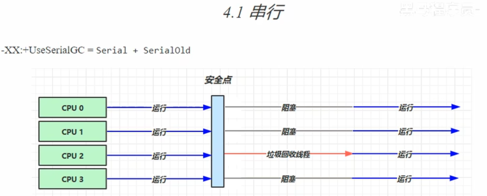
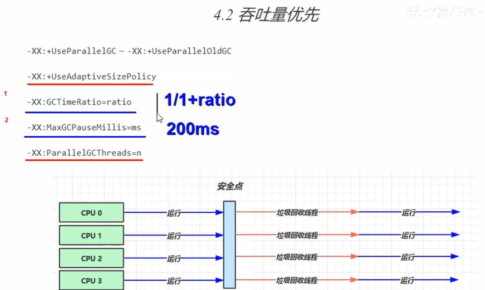
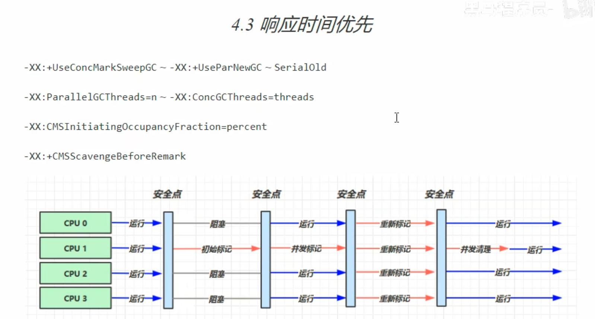

1. 串行
   - 单线程
   - 堆内存较小，适合个人电脑
2. 吞吐量优先
   - 多线程
   - 堆内存较大，多核CPU
   - 让单位时间内，STW的时间最短（总时间）
3. 响应时间优先
   - 多线程
   - 堆内存较大，多核CPU
   - 尽可能让单次STW的时间最短（每次垃圾回收时间短）

### 4.1 串行
- XX:+UseSerialGC = Serial + SerialOld
-                  复制算法 + 标记整理算法
-                    新生代     老年代

### 4.2 吞吐量优先
- 参数调整：
- XX:+UseParallelGC ~-XX:+UseParallelOldGC
- XX:+UseAdaptiveSizePolicy  动态调整伊甸园和from,to区大小（自适应方式）
- XX:GCTimeRatio=ratio   目标 1.根据设定目标，用来调整垃圾回收时间和总时间占比 1/（1+ratio）一般ratio（默认是99）设置19，调整堆的大小
- XX:MaxGCPauseMillis=ms  目标 2.暂定的时间，默认200ms
- XX:ParallelGCThreads=n   垃圾回收线程数
- 注：1和2是冲突的，1是设置单位时间内回收垃圾的时间，2是回收垃圾的的时间

### 4.3 响应时间优先
- XX:+UseConcMarkSweepGC ~ -XX:+UserParNewGC ~SerialOld
- XX:ParallelGCThreads=n ~ -XX:ConcGCThreads=threads
- XX:CMSInitiatingOccupancyFraction=percent
- XX:+CMSScavengeBeforeRemark

