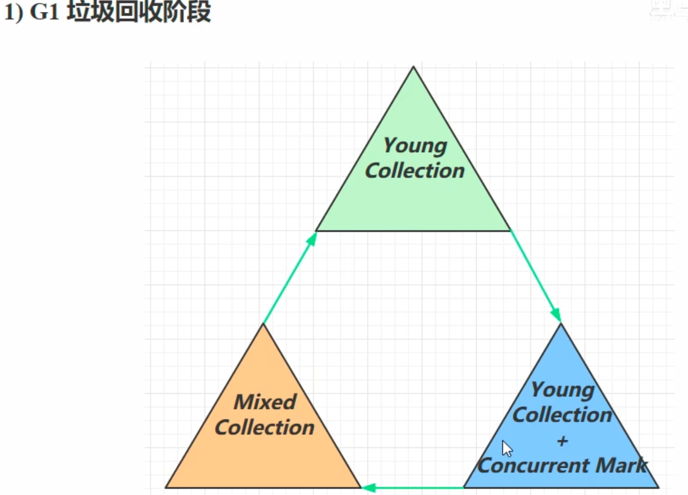
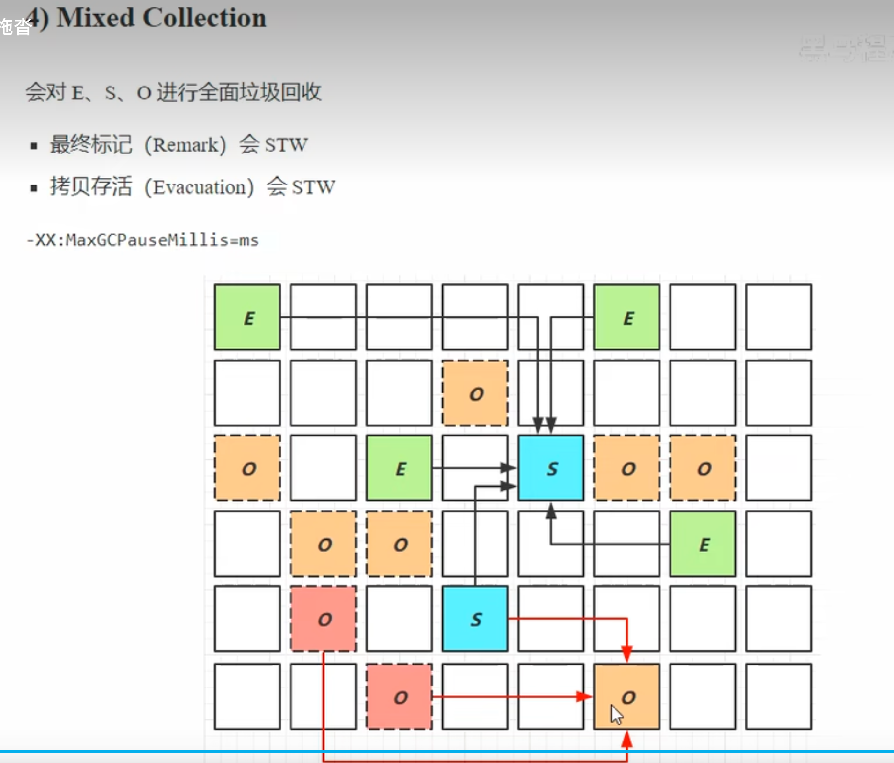

### 定义
1. JDK 9以后默认的垃圾回收器

### 适用场景
1. 同时注重高吞吐量和低延迟，默认停顿目标200ms
2. 适合超大堆内存，会将内存划分多个相同大小Region
3. 整体上是标记+整理算法，两个区域之间是复制算法

### 相关JVM参数
1. -XX:+UseG1GC   表示使用G1 作为垃圾回收器
2. -XX:G1HeapRegionSize=size  设置G1没有region的大小
3. -XX:MaxGCPauseMillis=time 设置最大GC暂停时间

### 1）G1垃圾回收阶段

### 2)Young Collection
- 会STW
- 每个区域大小相同，相互独立，之间使用复制算法，每个区域都有新生代（eden,S1,S2）和老年代
- 新创建的对象会分配在一块region中，当内存不足时，会发生一次垃圾回收，将没有被GC root 引用的对象回收

### 3）Young Collection + CM
1. Young Collection会进行初始 GC root标记- 不会占用并发标记时间
2. 当老年代的内存占用堆内存一定比例时候，会发生CM（并发标记），不会暂停用户线程的执行
3. 比例参数： -XX:InitiationHeapOccupancyPercent=percent (默认 45%)

### 4) Mixed Collection 混合收集

- 会对 E，S，O进行全面的垃圾回收
1. 最终标记（Remark）会STW
2. 拷贝存活（Evacuation）会STW
3. 最大暂停时间目标参数：-XX: MaxGCPauseMills=ms
4. 从图片中可以看出，只是对部分老年代进行了回收，原因是由于堆内存可能比较大，对所有的老年代都回收会超过最大暂停时间,优先回收垃圾最多的区域

### 5）Full GC
- serial GC
  - 新生代内存不足发生的垃圾回收 -minor gc
  - 老年代内存不足发生的垃圾回收 - full gc

- parallel GC
  - 新生代内存不足发生的垃圾回收 -minor gc
  - 老年代内存不足发生的垃圾回收 - full gc

- CMS GC
  - 新生代内存不足发生的垃圾回收 -minor gc
  - 老年代内存不足，

- G1 
  - 新生代内存不足发生的垃圾回收 -minor gc
  - 老年代内存不足
    - 1.当老年代内存占用超过45%时
    - 2.并且当垃圾回收的速度慢于产生的速度时，并发收集失败，发展为串行回收，才会发生full gc，可以从gc日志中查看有full gc 

### 6） Young Collection 跨代引用
- 新生代回收的跨代引用（老年代引用新生代）问题
- 利用卡表技术，将老年代一个region拆分为多个卡槽，标记哪些卡槽时脏卡，下一次找老年代gc root时直接从卡表中找
