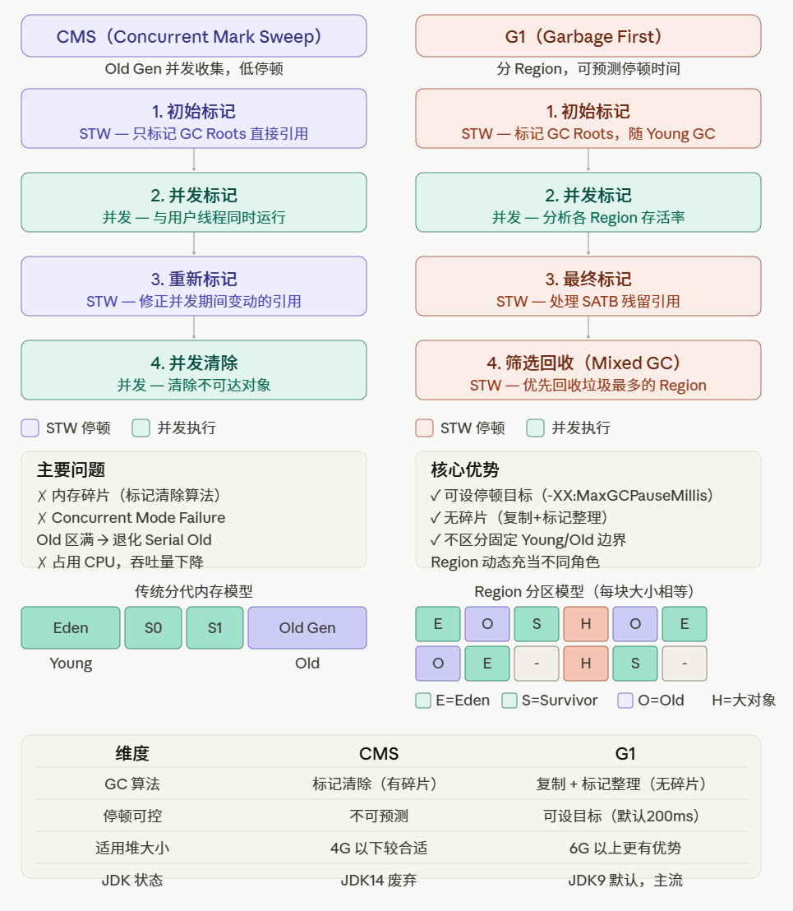

### 常见面试题
1. CMS 为什么会产生碎片？
   >因为 CMS 用的是标记清除算法，只清除对象但不移动剩余对象，所以 Old 区会留下不连续的空洞。时间长了分配大对象找不到连续空间，就触发 Full GC，退化成 Serial Old 来做一次带整理的 Full GC，这就是所谓的 Concurrent Mode Failure。
2. G1 怎么做到停顿可预测的？
   > G1 把堆切成大小相等的 Region（默认 1~32MB），每次 GC 只选"垃圾最多、回收收益最大"的 Region 来回收（Garbage First 名字的由来）。每个 Region 都有存活率统计，G1 会根据你设置的 -XX:MaxGCPauseMillis 目标，动态决定这次 GC 回收多少个 Region，不够时间就停，下次再回收剩下的。
3. CMS 的 Concurrent Mode Failure 是什么？怎么避免？
   >并发标记和清除阶段用户线程还在产生新对象写入 Old 区，如果 Old 区在 CMS 还没回收完之前就满了，CMS 就来不及并发回收，只能 STW 降级成 Serial Old 做 Full GC，停顿时间会暴增。避免方法是调低 CMS 触发阈值（-XX:CMSInitiatingOccupancyFraction，默认 92% 太高），比如调到 70%，让 CMS 提前启动。
4. G1 的 Mixed GC 是什么？
   >Mixed GC 是 G1 特有的，既回收所有 Young Region，又回收部分 Old Region（存活率低的优先），介于 Young GC 和 Full GC 之间。这是 G1 控制停顿时间的核心手段，不需要一次性回收全部 Old 区。
5. 什么时候选 CMS，什么时候选 G1？
   >CMS 适合堆较小（4G 以下）、对延迟敏感但堆不算大的场景。G1 适合大堆（6G 以上）、需要可预测停顿的场景，而且 JDK9 之后 G1 已经是默认 GC，CMS 在 JDK14 被彻底废弃。面试直接说"新项目用 G1，老项目 JDK 版本低才考虑 CMS"即可。

