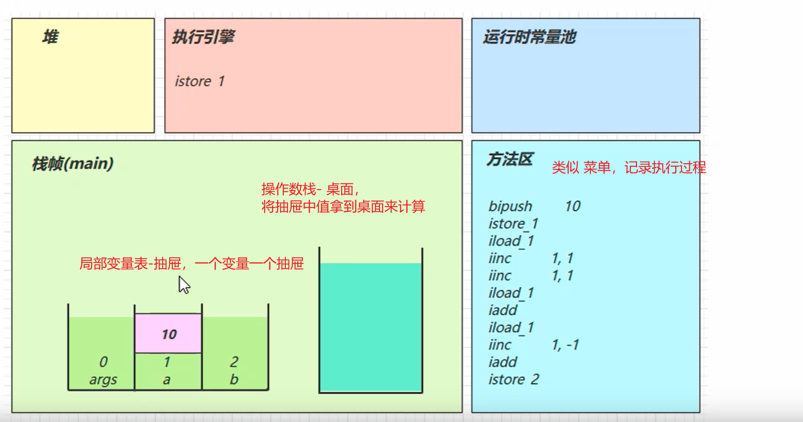
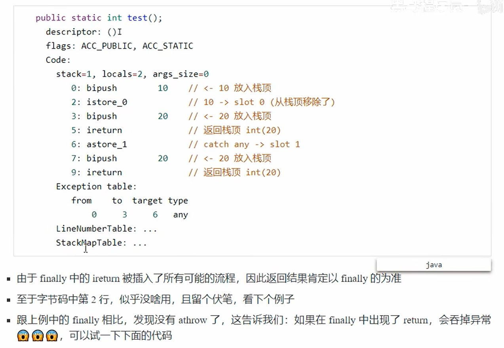
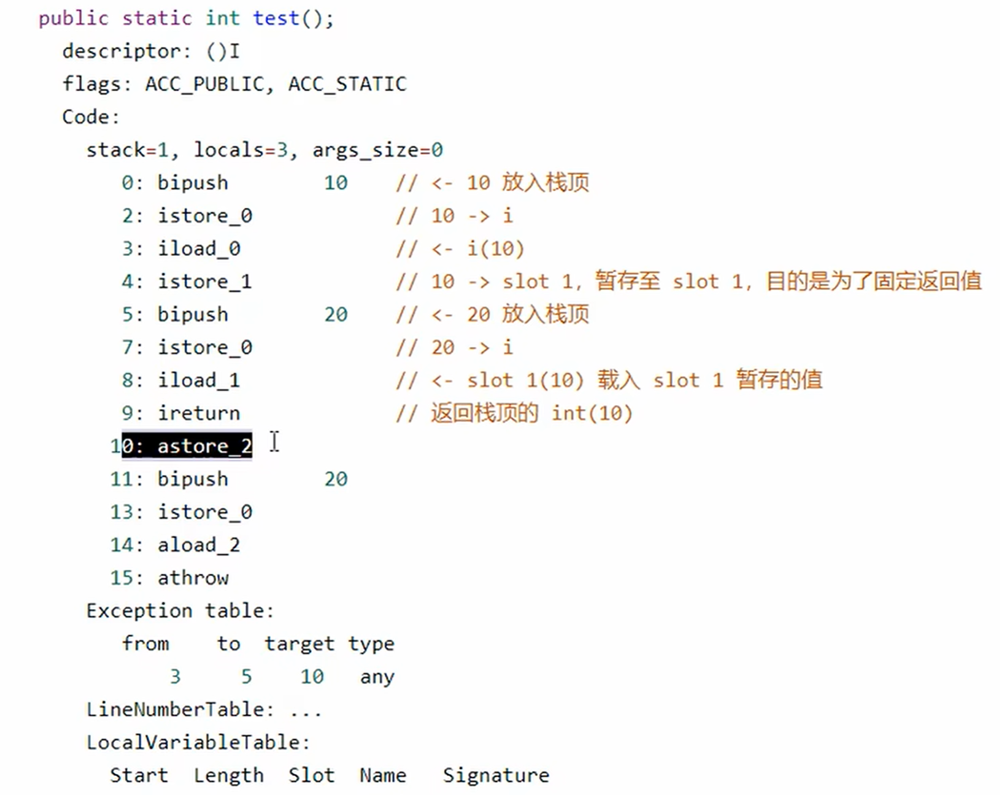
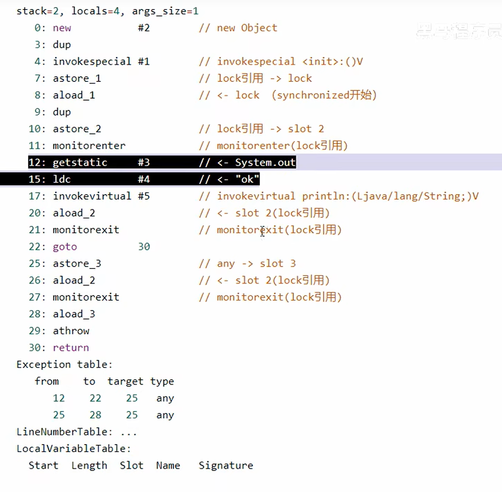

### 1. 字节码指令

> 字节码指令是 JVM 执行 Java 程序的最小单元。每条指令由一个**操作码（opcode）**和可选的操作数组成。
> 理解字节码，需要先了解两个核心结构：
> - **局部变量表（Local Variable Table）**：相当于"抽屉"，存放方法中的局部变量，按槽位（slot）编号，从 0 开始
> - **操作数栈（Operand Stack）**：相当于"桌面"，所有计算都在这里进行，先入后出（LIFO）

#### 1.1 常用字节码指令速查

| 指令 | 含义 |
|------|------|
| `iload_n` | 将局部变量表第 n 个槽位的 int 值压入操作数栈 |
| `istore_n` | 将操作数栈顶的 int 值弹出，存入局部变量表第 n 个槽位 |
| `bipush n` | 将 byte 范围内的整数常量 n 压入操作数栈 |
| `iconst_n` | 将 -1~5 范围内的整数常量压入操作数栈（比 bipush 更短） |
| `iadd` | 弹出栈顶两个 int 值相加，结果压栈 |
| `iinc n, m` | 将局部变量表第 n 个槽位的值直接加 m（**不经过操作数栈**） |
| `ireturn` | 将栈顶 int 值作为返回值返回 |
| `return` | 方法返回（void） |

#### 1.2 从字节码角度分析 `a++` 计算过程

> 核心区别：
> - `a++`（后置自增）：**先将 a 的当前值压栈，再对局部变量表中的 a 执行 +1**
> - `++a`（前置自增）：**先对局部变量表中的 a 执行 +1，再将新值压栈**
> - `iinc` 指令直接操作局部变量表，**不影响操作数栈中已压入的值**



```java
// 从字节码角度分析以下代码的执行过程
public class ByteA {
    public static void main(String[] args) {
        int a = 10;
        int b = a++ + ++a + a--;
        System.out.println(a);  // 结果：11
        System.out.println(b);  // 结果：34
    }
}
```

**字节码执行过程逐步分析（a 在局部变量表 slot 1，b 在 slot 2）：**

```
// int a = 10
bipush 10       // 将 10 压入操作数栈：栈[10]
istore_1        // 弹出 10，存入 slot1(a)：a=10，栈[]

// 计算 a++ → 先取值压栈，再自增
iload_1         // 将 a(10) 压栈：栈[10]
iinc 1, 1       // 局部变量表 slot1 直接 +1：a=11（栈不变）

// 计算 ++a → 先自增，再取值压栈
iinc 1, 1       // 局部变量表 slot1 直接 +1：a=12
iload_1         // 将 a(12) 压栈：栈[10, 12]

// 计算 a++ 的加法
iadd            // 弹出 10 和 12，相加得 22，压栈：栈[22]

// 计算 a-- → 先取值压栈，再自减
iload_1         // 将 a(12) 压栈：栈[22, 12]
iinc 1, -1      // 局部变量表 slot1 直接 -1：a=11（栈不变）

// 计算最终加法
iadd            // 弹出 22 和 12，相加得 34，压栈：栈[34]
istore_2        // 弹出 34，存入 slot2(b)：b=34，栈[]
```

> 💡 **结论**：`a = 11`，`b = 10 + 12 + 12 = 34`
> 关键点：`iinc` 指令直接修改局部变量表，不影响已经压入操作数栈的值，这就是后置 `a++` 能"先用旧值"的原因。

---

### 2. 字节码指令 — 条件判断

> 条件判断指令用于实现 `if/else`，本质是**比较两个值后决定是否跳转**到指定字节码偏移位置。

#### 常用条件跳转指令

| 指令 | 含义 |
|------|------|
| `ifeq n` | 栈顶值 == 0 则跳转到偏移 n |
| `ifne n` | 栈顶值 != 0 则跳转 |
| `iflt n` | 栈顶值 < 0 则跳转 |
| `ifge n` | 栈顶值 >= 0 则跳转 |
| `ifgt n` | 栈顶值 > 0 则跳转 |
| `ifle n` | 栈顶值 <= 0 则跳转 |
| `if_icmpeq n` | 弹出两个 int，相等则跳转 |
| `if_icmpge n` | 弹出两个 int，前者 >= 后者则跳转 |
| `if_icmplt n` | 弹出两个 int，前者 < 后者则跳转 |
| `goto n` | 无条件跳转到偏移 n |

---

### 3. 循环控制指令

> 循环本质上是**条件判断 + goto 跳转**的组合，JVM 没有专门的循环指令。

```java
public class Demo3_4 {
    public static void main(String[] args) {
        int a = 0;
        while (a < 10) {
            a++;
        }
    }
}
```

**对应字节码：**

```
0:  iconst_0        // 将常量 0 压栈
1:  istore_1        // 弹出 0，存入 slot1(a)：a=0

// while 循环判断入口（每次循环都回到这里）
2:  iload_1         // 将 a 压栈
3:  bipush 10       // 将 10 压栈
5:  if_icmpge 14    // 若 a >= 10，跳转到偏移 14（退出循环）

// 循环体
8:  iinc 1, 1       // a++（直接操作局部变量表）
11: goto 2          // 无条件跳回偏移 2，继续判断

14: return          // 方法返回
```

> 💡 **执行流程**：`iconst_0 → istore_1 → [iload_1 → bipush 10 → if_icmpge → iinc → goto] × 10次 → return`

#### 练习题 — 判断结果

```java
// 请从字节码角度分析，下列代码运行结果
public class Demo_3_6_1 {
    public static void main(String[] args) {
        int i = 0;
        int x = 0;
        while (i < 10) {
            x = x++;   // ⚠️ 注意这里
            i++;
        }
        System.out.println(x);  // 结果是 0
    }
}
```

**为什么 `x = x++` 结果 x 永远是 0？**

```
// x = x++ 的字节码分析（x 在 slot2）
iload_2         // 将 x 的当前值(0)压栈：栈[0]
iinc 2, 1       // 局部变量表 slot2 直接 +1：x=1（栈不变）
istore_2        // 将栈顶值(0)弹出，存回 slot2：x=0  ← 覆盖了 iinc 的结果！
```

> 💡 **结论**：`x++` 先将旧值 `0` 压栈，`iinc` 让 x 变为 1，但随后 `istore_2` 把栈顶的旧值 `0` 写回了 x，导致 x 永远是 0。

---

### 2.8 构造方法

#### 1）`<clinit>()V` — 静态初始化方法

> 编译器会按照**从上往下**的顺序，收集所有 `static` 静态代码块和静态成员赋值的代码，合并为一个特殊的方法 `<clinit>()V`，在**类加载的初始化阶段**由 JVM 自动调用（且只调用一次）。

```java
public class Demo3_8_1 {
    static int i = 10;

    static {
        i = 20;
    }

    static {
        i = 30;
    }
}
```

**合并后的 `<clinit>` 字节码：**

```
0:  bipush 10       // 将 10 压栈
2:  putstatic #2    // 弹出 10，赋值给静态字段 i：i=10
5:  bipush 20       // 将 20 压栈
7:  putstatic #2    // 弹出 20，赋值给静态字段 i：i=20
10: bipush 30       // 将 30 压栈
12: putstatic #2    // 弹出 30，赋值给静态字段 i：i=30
15: return
```

> 💡 **最终结果**：`i = 30`（按顺序执行，后面的赋值覆盖前面的）

---

#### 2）`<init>()V` — 实例初始化方法

> 编译器会按**从上往下**的顺序，收集所有 `{}` 实例代码块和实例成员变量赋值的代码，插入到构造方法的**最前面**，原始构造方法内部的代码**总是在最后执行**。

```java
public class Demo3_8 {
    private String a = "s1";   // ① 成员变量赋值

    {
        b = 20;                // ② 实例代码块
    }

    private int b = 10;        // ③ 成员变量赋值

    {
        a = "s2";              // ④ 实例代码块
    }

    public Demo3_8(String a, int b) {
        this.a = a;            // ⑤ 构造方法体（最后执行）
        this.b = b;
    }

    public static void main(String[] args) {
        Demo3_8 s3 = new Demo3_8("s3", 30);
        System.out.println(s3.a);  // 结果：s3
        System.out.println(s3.b);  // 结果：30
    }
}
```

**`<init>` 执行顺序（编译器合并后）：**

```
① a = "s1"   → a="s1"
② b = 20     → b=20
③ b = 10     → b=10（覆盖②）
④ a = "s2"   → a="s2"（覆盖①）
⑤ this.a = a → a="s3"（构造方法体，最后执行）
   this.b = b → b=30
```

> 💡 **最终结果**：`a = "s3"`，`b = 30`

---

### 2.9 方法调用

> JVM 提供了 4 种方法调用指令，对应不同的调用场景：

| 指令 | 适用场景 |
|------|---------|
| `invokespecial` | 调用构造方法 `<init>`、私有方法、父类方法（**静态绑定**，编译期确定） |
| `invokevirtual` | 调用普通实例方法（**动态绑定**，运行期根据对象实际类型确定） |
| `invokestatic` | 调用静态方法（**静态绑定**） |
| `invokeinterface` | 调用接口方法（**动态绑定**） |
| `invokedynamic` | 支持动态语言，Lambda 表达式底层使用 |

```java
public class Demo3_9 {
    public Demo3_9() { }

    private void test1() { }          // 私有方法

    private final void test2() { }    // final 私有方法

    public void test3() { }           // 普通公有方法

    public static void test4() { }    // 静态方法

    public static void main(String[] args) {
        Demo3_9 d = new Demo3_9();    // invokespecial → <init>
        d.test1();                    // invokespecial（私有方法，静态绑定）
        d.test2();                    // invokespecial（private final，静态绑定）
        d.test3();                    // invokevirtual（普通方法，动态绑定）
        d.test4();                    // invokestatic（静态方法）
        Demo3_9.test4();              // invokestatic（静态方法，推荐写法）
    }
}
```

> 💡 **关键点**：`private` 和 `final` 方法不能被重写，编译期就能确定调用目标，使用 `invokespecial`（静态绑定，性能更好）。`public` 普通方法可能被子类重写，必须用 `invokevirtual`（动态绑定）。

---

### 2.10 多态原理

> `invokevirtual` 实现多态的底层机制依赖 **vtable（虚方法表）**。

**执行步骤：**

1. 运行代码，触发 `invokevirtual` 指令
2. 通过栈帧中的**对象引用**找到堆中的对象
3. 读取对象头中的**类型指针**，找到对象的实际 Class
4. Class 结构中有 **vtable（虚方法表）**，它在类加载的**链接阶段**就已根据方法重写规则生成好了
5. 在 vtable 中查表，得到该方法的**实际内存地址**
6. 执行该地址处的字节码

> 可以使用 **HSDB（HotSpot Debugger）** 工具在运行时查看对象内存结构和 vtable 内容来验证上述过程。

**小结：**
- 子类重写父类方法后，子类的 vtable 中对应槽位会指向子类的方法地址
- 父类引用指向子类对象时，通过 vtable 找到的是子类方法 → 实现多态
- `invokespecial`（私有/构造方法）不走 vtable，直接静态绑定，性能更高

---

### 2.11 异常处理 — 字节码角度分析

> JVM 通过**异常表（Exception Table）**来处理异常，而非跳转指令。异常表记录了每个 try 块的范围、捕获的异常类型，以及对应 catch 块的入口地址。

#### 1）try-catch

#### 2）多个 single-catch 块

> 每个 catch 对应异常表中的一行，JVM 发生异常时遍历异常表，找到第一个匹配的行并跳转。

#### 3）multi-catch

> `catch (ExceptionA | ExceptionB e)` 语法糖，编译后在异常表中生成多行，指向同一个 catch 块入口。

#### 4）finally

```java
public class Demo3_11_4 {
    public static void main(String[] args) {
        int i = 0;
        try {
            i = 10;
        } catch (Exception e) {
            i = 20;
        } finally {
            i = 30;
        }
    }
}
```

**字节码关键特征：**

> `finally` 中的代码会被编译器**复制 3 份**，分别插入到：
> 1. **try 正常结束**后执行
> 2. **catch 块结束**后执行
> 3. **catch 未捕获到的其他异常**发生时执行（执行完 finally 后继续抛出异常）

```
// try 块
i = 10
// finally 副本1（try 正常结束后）
i = 30
goto 结束

// catch 块
i = 20
// finally 副本2（catch 结束后）
i = 30
goto 结束

// 其他异常处理
// finally 副本3（兜底，处理未被 catch 捕获的异常）
i = 30
athrow  // 重新抛出异常
```

---

### 2.12 练习 — finally 面试题

#### 题目一：finally 中出现 return

```java
public class Demo3_12_2 {
    public static void main(String[] args) {
        int result = test();
        System.out.println(result);  // 结果：20
    }

    public static int test() {
        try {
            return 10;
        } finally {
            return 20;  // ⚠️ finally 中的 return 会覆盖 try 中的 return
        }
    }
}
```



> 💡 **结论**：`finally` 中的 `return 20` 会**覆盖** `try` 中的 `return 10`，最终返回 **20**。
> ⚠️ **最佳实践**：永远不要在 `finally` 中写 `return`，会吞掉 try/catch 中的返回值甚至异常！

---

#### 题目二：finally 对返回值的影响

```java
public class Demo3_12_2 {
    public static void main(String[] args) {
        int result = test();
        System.out.println(result);  // 结果：10
    }

    public static int test() {
        int i = 10;
        try {
            return i;   // ① 将 i 的值(10)暂存到一个临时槽位
        } finally {
            i = 20;     // ② 修改 i，但不影响①中已暂存的值
        }
    }
}
```



**字节码执行过程：**

```
iload_0         // 将 i(10) 压栈
istore 临时槽   // 将 10 暂存到临时局部变量槽位（这是 return 的值）
// 执行 finally
bipush 20
istore_0        // i = 20（修改的是局部变量 i，不影响临时槽位）
// 返回临时槽位中的值
iload 临时槽
ireturn         // 返回 10
```

> 💡 **结论**：`return i` 执行时，JVM 会先把 `i` 的值**复制到一个临时槽位**，finally 中对 `i` 的修改不影响这个临时值，最终返回 **10**。

---

### 2.13 synchronized — 字节码角度分析

```java
public class Demo3_13 {
    public static void main(String[] args) {
        Object lock = new Object();
        synchronized (lock) {
            System.out.println("ok");
        }
    }
}
```



**字节码关键指令：**

| 指令 | 含义 |
|------|------|
| `monitorenter` | 尝试获取对象的 monitor 锁（进入 synchronized 块） |
| `monitorexit` | 释放对象的 monitor 锁（退出 synchronized 块） |

**字节码结构分析：**

```
// 创建锁对象
new #2              // 创建 Object 实例
dup                 // 复制引用（一份用于 <init>，一份存入局部变量）
invokespecial #3    // 调用 Object.<init>()
astore_1            // 存入 slot1(lock)

// 加锁
aload_1             // 将 lock 压栈
monitorenter        // 获取 lock 的 monitor 锁

// 同步块内容
getstatic #4        // System.out
ldc #5              // "ok"
invokevirtual #6    // println

// 正常退出：释放锁
aload_1
monitorexit         // 释放锁（正常路径）
goto 结束

// 异常退出：也要释放锁（保证锁一定被释放）
aload_1
monitorexit         // 释放锁（异常路径）
athrow              // 重新抛出异常
```

> 💡 **关键点**：编译器会自动生成**两个 `monitorexit`**，分别处理正常退出和异常退出，确保无论如何都能释放锁，这就是 `synchronized` 不会死锁（因异常忘记释放锁）的原因。
