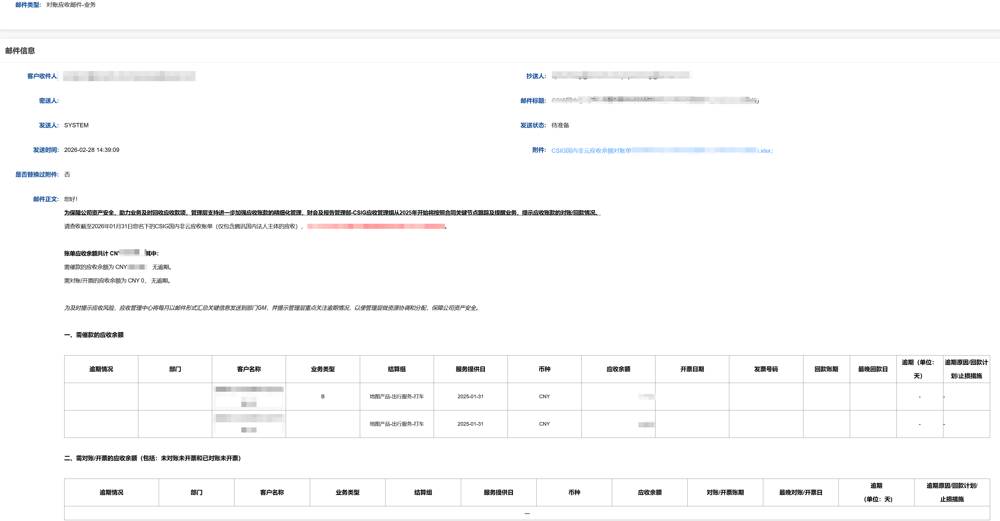
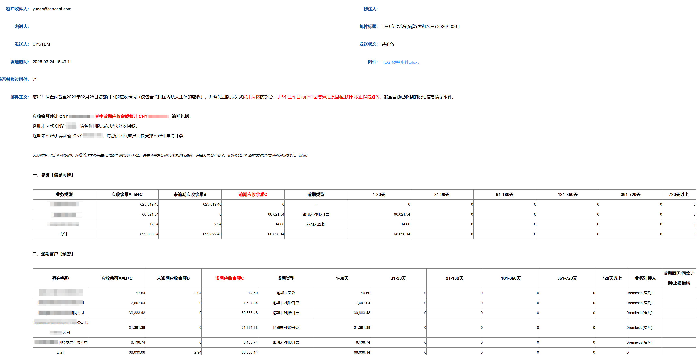

## 已完成记录

### 1. TEG 逾期账单发送发票邮件 -- 定时任务
- **谁用的功能**:财管/销售用，通知客户还款
- **需求**:TEG需要根据出具的发票，通过邮件方式通知客户付款
- **解决的问题**:在邮件中可以详细的说明客户的欠款情况，希望客户按照发票上的的费用支付

1. 任务入参 applyDate 发票申请时间
2. 获取Mysql中配置的发票模版
3. 获取Mysql中ims_bill_range_config维护的OU, 渠道，结算组关系配置表
4. 查询Mysql中ims_bill_mdm_config维护的mdmId客户，取出该BG需要出账的客户信息（发票日/应收日，信用期，客户邮箱地址，是否自动逾期，发票收件人等），如果查不到客户，就直接返回null
5. 通过ouId,mdmId,applyDate查询发票申请表，如果查不到直接返回null结束任务
6. 得到发票申请记录List,通过得到的对象中invoiceFileId 从idc 中获取发票byte数组，再上传到Jarvis图片服务器，得到一个新的fileId
7. 给发票邮件内容模版赋值，并填充发票图片fileId到内容中
8. 任务执行结束后，生成状态为待发送的邮件，业务确认后可以发送给`4`中配置的发票收件人

### 2. TEG,PCG FIT 月对账单自动催逾期任务
**由于各BG逻辑类似这里以FIT为例:**
- **谁用的功能**:财管/应收账款
- **需求**:需要通知逾期客户尽快还款
- **解决的问题**:使用邮件的方式 督促客户还款，邮件附件中可以标明详细的应收情况

- 代码实现逻辑如下:
1. 任务入参财务对象月份 periodName,按该月出账
2. 删除历史 periodName 月份的出账数据，从新生成，从配置表ims_bill_mdm_config获取该BG下需要出账的客户
3. 从数据范围表ims_bill_range_config（维护OU，渠道，结算组关联信息）中获取ouIds，channelIds,settlementGroupIds
4. 遍历所有的mdmId，单独去生成账单,分别通过mdmId，ou,channelId,结算组查询应收，发票，回款
5. 以OU的维度统计账期下的应收
6. 生成附件（pdf,excel）并上传到Jarvis平台，将生成的fileId存入账单对象中
7. 同时将发票打包存入账单

### 3. 时点余额(各个BG应收余额对账单-销售的邮件，应收余额预警-GM的邮件)
- **谁用的功能**:财管、销售、财管负责人
- **需求**: 对账催收平台-账单需求
- **解决的问题**:提醒销售应收账款的对账/回款情况
- 
[reconciliation_receivables_info.sql](../sql/reconciliation_receivables_info.sql)

- **邮件中的列表内容都是来自reconciliation_receivables_info**

- 销售邮件，了解当前的逾期情况

- GM 邮件 了解团队催收进度

### 4. 差异调整预提--对用于应收金额的调整-海外环境
1. 

